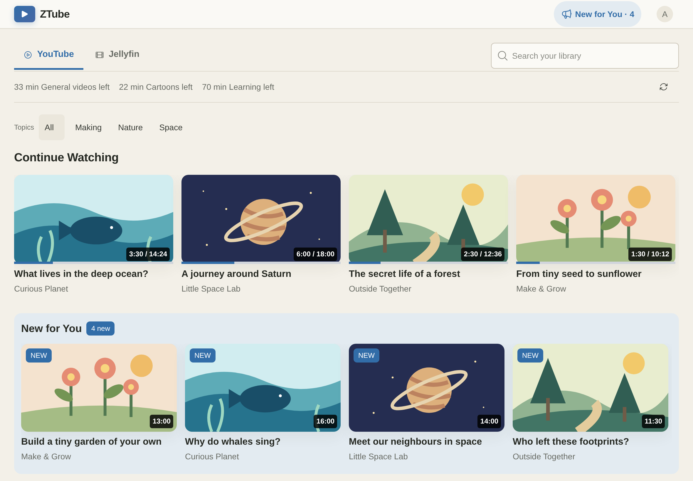
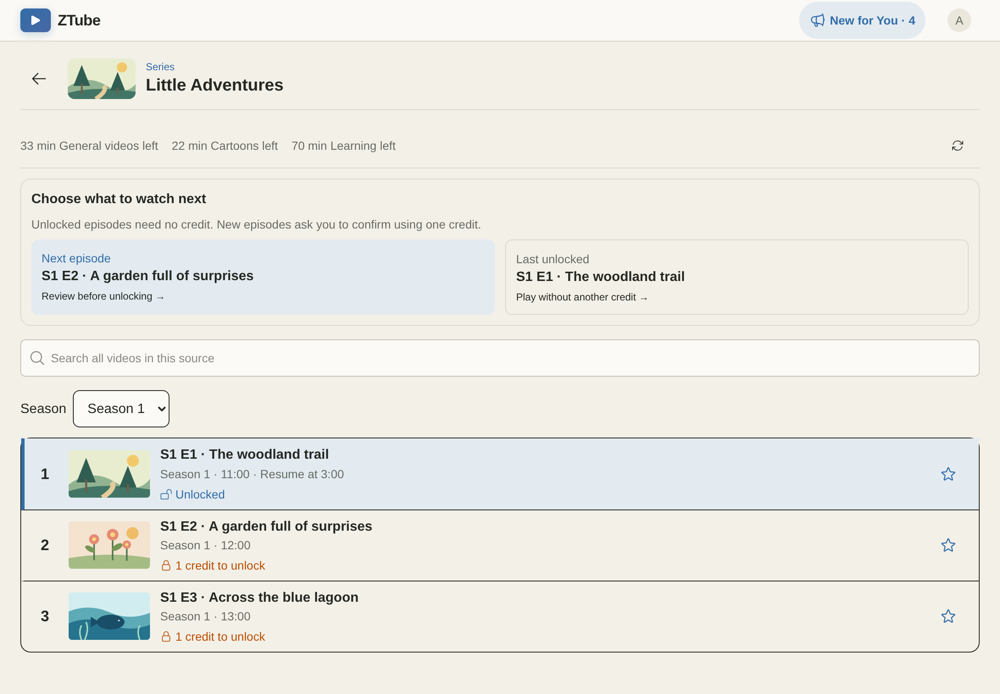
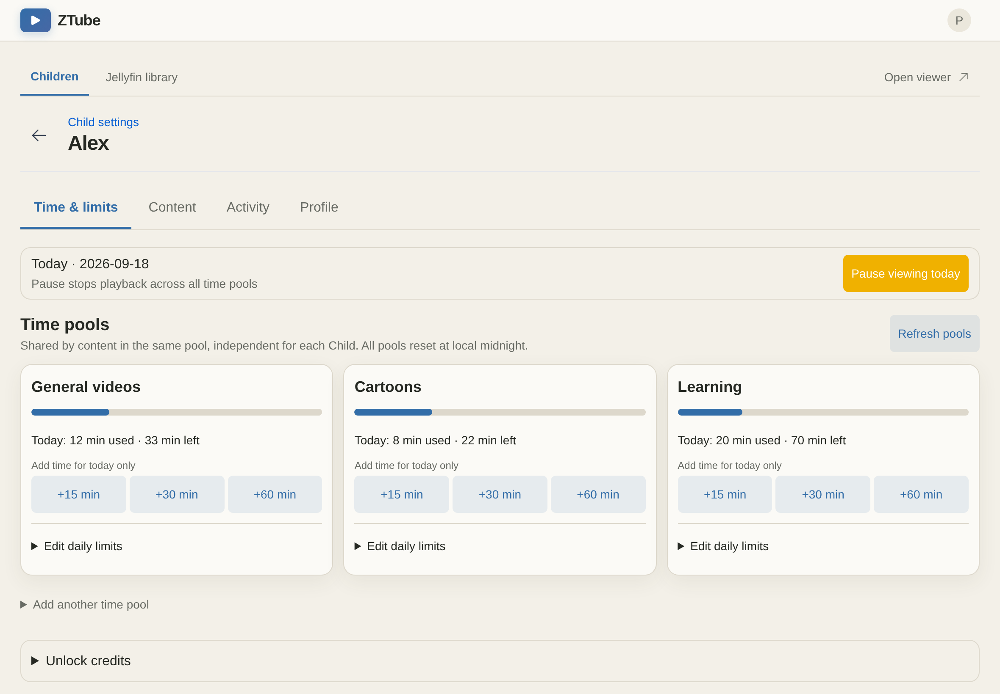

# ZTube

A self-hosted video library for families. Admins choose what each Child can watch
from YouTube or Jellyfin, and set daily viewing budgets and required breaks.
Built with Vue, Hono, Cloudflare Workers and D1. Licensed under [MIT](LICENSE).



*Real interface, fictional demo content.*

- Approve channels, playlists or individual videos separately for each Child.
- Organize viewing budgets into Time Pools, with weekday/weekend allowances.
- Set Viewing Windows, Required Breaks, Viewing Pause and extra minutes for today.
- Give daily Unlock Credits for new episodes; an Episode Unlock is permanent while
  the content remains approved. Replays still consume Watch Time.
- Browse Favorites, Recommendations and Continue Watching on compact iPad layouts.
- Review aggregate daily usage and 30 days of per-video Viewing Events.

**ZTube controls playback inside its own player.** It is not a device-level filter
or DRM: direct media links may work outside its controls. Read the
[security boundaries](SECURITY.md) before sharing an instance with Children.

## A look inside

**Choose the next episode.** Browse Jellyfin series by season, resume an unlocked
episode, or use an Unlock Credit to try a new one.



**Set a routine for each Child.** Give different kinds of content their own Time
Pools, add extra minutes for today, and configure viewing hours and breaks.



These are screenshots of the real interface with fictional accounts, sample
content and original illustrative covers. No real family or server data is shown.
See [how to regenerate them](docs/screenshots/README.md).

## Self-host on Cloudflare

This is the supported deployment path; a separate application server or Docker
host is not required. Jellyfin servers, if used, are hosted separately.

### 1. Prepare your accounts and tools

You need:

- **Node.js 24 or newer**, npm and Git. Node 24 LTS is the recommended version.
- A **Cloudflare account**, a domain using Cloudflare DNS, and a Zero Trust team.
- An email address for each Admin and Child; Cloudflare Access handles sign-in.
- For YouTube: a Google Cloud project with **YouTube Data API v3** enabled and an
  API key restricted to that API. Do not restrict it by browser referrer; the
  Worker makes these requests. See [Google's setup guide][youtube].

Check Cloudflare/Google quotas and current pricing for your usage. YouTube is
optional if you use only Jellyfin.

```sh
git clone https://github.com/ztube-org/ztube.git
cd ztube
npm ci
npx playwright install chromium
npx cf auth login
npx cf d1 create --name ztube-db
```

On Linux, Playwright may also request system packages; follow its output or run
`npx playwright install-deps chromium`. Browser installation is needed because
the deploy command includes UI verification. Use a different database name if
`ztube-db` already exists in your account.

### 2. Configure sign-in before deploying

Keep your ZTube endpoint private: use **Cloudflare Access** to allow only your
household's email addresses. This protects the app and its API from public access.

In **Cloudflare Zero Trust → Access → Applications**, add a **Self-hosted**
application for your chosen hostname, for example `videos.example.com`.

1. Protect the **entire hostname**, not just a path.
2. Add an **Allow** policy listing only your family's Admin and Child emails.
3. Choose an identity provider; **One-time PIN** supports email sign-in.
4. Copy the application's **Application Audience (AUD) tag** and your team's
   URL, for example `https://your-team.cloudflareaccess.com`.

An Admin email must be included in the Access policy as well as `ADMIN_EMAILS`.
Do not add a Bypass policy or an unprotected alternate route. ZTube also verifies
Access JWT signatures, issuer, audience and expiry on every API request.

### 3. Edit the deployment configuration

[`cloudflare.config.ts`](cloudflare.config.ts) is the deployment configuration.
The project pins `cf` beta and the Cloudflare Vite plugin beta; builds and deploys
use `cf`, without Wrangler. Create your ignored instance settings:

```sh
cp cloudflare.instance.example.json cloudflare.instance.json
```

Edit `cloudflare.instance.json` with your own values:

| Field | Value to use |
| --- | --- |
| `accountId` | Your Cloudflare account ID |
| `workerName` | Your Worker name, e.g. `ztube` |
| `domain` | The hostname protected by Access |
| `databaseName` | The name used in `cf d1 create` |
| `databaseId` | The UUID returned by `cf d1 create` |
| `accessIssuer` | Your Zero Trust team URL, including `https://` |
| `accessAud` | Your Access application's AUD tag |

Keep `AUTH_MODE` set to `access`, and keep `workersDev` and `previewUrls`
disabled in `cloudflare.config.ts`. Do not put secrets in either configuration file.
Without an instance file, local development and CI use the example values;
production scripts require a configured instance.

```sh
npm run cf:typegen
npm run db:migrate:remote
npm run deploy -- --dry-run
```

Apply **all** migrations before deploying. The database scripts use the configured
D1 ID and the existing `d1_migrations` table. `npm run deploy` runs the server and
browser tests, lint, type generation and checks, then deploys with `cf`.
`--dry-run` builds and validates without uploading. Set secrets for the first
real deployment as described below. Cloudflare may need time to activate the
custom domain's certificate.

The YouTube sync heartbeat runs every 30 minutes, processes at most one source
per run, and refreshes completed sources only after 24 hours. Channels, YouTube
playlists and individual videos share this queue. Each automatic run has a
20-request budget; large sources save their progress and take turns with other
due sources on later heartbeats. The last complete catalog stays available until
the replacement is ready. Manual **Sync** can refresh early and resumes unfinished
work with a 40-request budget. Channel sync reads only the newest 200 upload
entries (at most four pages / nine YouTube requests), including on manual refresh.
Shorts and unsupported videos are filtered within that window, so fewer than 200
playable videos may remain. A successful sync replaces the channel catalog with
this window; separately approved videos are unaffected. Explicit YouTube playlists
continue to sync in full. Completed syncs insert new videos, update changed metadata
or ordering, and delete videos outside the new snapshot. Unchanged catalog rows
are not rewritten; freshness is tracked on the approved source.

Jellyfin libraries sync only when the Admin selects **Sync**. Playback and retention
cleanup still run separately at minutes 5 and 35, without refreshing libraries.

### 4. Set your Worker secrets

Create an ignored `.secrets.production.json` file containing your secret values:

```json
{
  "ADMIN_EMAILS": "parent1@example.com,parent2@example.com",
  "YOUTUBE_API_KEY": "",
  "PROVIDER_ENCRYPTION_KEY": ""
}
```

Set the YouTube key if you use YouTube. For Jellyfin or WebDAV, generate a random
32-byte base64 encryption key and put it in `PROVIDER_ENCRYPTION_KEY`:

```sh
node -e "console.log(require('node:crypto').randomBytes(32).toString('base64'))"
```

Save the encryption key in a password manager and **keep it with your backups**.
Replacing it makes existing connections unreadable. Leave unused service keys
empty. Deploy the code and secrets together:

```sh
npm run deploy -- --secrets-file .secrets.production.json
```

`ADMIN_EMAILS` is comma-separated and case-insensitive. For future deployments,
`npm run deploy` retains the existing Worker secrets. Pass `--secrets-file` when
you need to update them. Never commit this file or put secret values in command
arguments.

### 5. Sign in and add content

1. Open your hostname in a private browser window. Verify that Access denies an
   email outside your Allow policy.
2. Sign in with an Admin email. You should see the Admin dashboard. Every account,
   including an Admin, automatically receives its own Child profile.
3. Sign in once with each Child email so their profiles appear in the dashboard.
4. Set each Child's time zone, Time Pools, Viewing Window and Required Break.
5. Add approved YouTube URLs, or connect a [Jellyfin library](docs/jellyfin.md),
   then share the Playlists with that Child.
6. Play an approved video as the Child. Check that Watch Time increases while
   playing, stops while paused, and Admin Viewing Pause stops playback.

Videos must be longer than three minutes. Each Child starts with General videos,
Cartoons and Learning pools; their settings are independent. Cartoon Pool episodes
require confirmation before spending an Unlock Credit. Unused credits and
Temporary Extensions expire at midnight in the Child's time zone; permanent
Episode Unlocks do not.

For iPad setup, backups, upgrades and troubleshooting, continue with the
[self-hosting operations guide](docs/self-hosting.md).

### iPad tips: add a Home Screen icon and block direct YouTube access

Open ZTube in **Safari**, sign in as the Child, then tap **Share → Add to Home
Screen**. Keep **Open as Web App** enabled if offered. Children can then tap the
ZTube icon on their Home Screen to open it like an app.

On your Child's iPad, use **Screen Time** to block `youtube.com` while allowing
your ZTube hostname. ZTube embeds YouTube through **`youtube-nocookie.com`**, so
the player uses a different domain from the main YouTube website.

1. Set a Screen Time passcode the Child does not know.
2. Open **Content & Privacy Restrictions → Web Content → Limit Adult Websites**
   and add `youtube.com`, `www.youtube.com`, `m.youtube.com` and `youtu.be` to
   **Never Allow**. Menu names vary by iPadOS version.
3. Keep your ZTube hostname and the player/media hosts `youtube-nocookie.com`,
   `googlevideo.com`, `ytimg.com` and `gstatic.com` accessible.
4. Remove the YouTube app and restrict its reinstallation if needed; website
   restrictions alone do not block the app.

Test both that ZTube still plays videos and that direct YouTube access is blocked.
This helps close the direct website/app routes around ZTube; it is not a guarantee
against every bypass. See the [iPad setup guide](docs/self-hosting.md#set-up-an-ipad)
for more details.

## Run locally

No Cloudflare account is needed for local D1 development. Leave the instance
example unchanged and create a local secrets file:

```sh
npm ci
cp .dev.vars.example .dev.vars
npm run db:migrate:local
npm run dev
```

Local state lives in ignored `.cloudflare/state/`; previous `.wrangler/state/`
files are left untouched and are not automatically imported.

Open `http://localhost:5173`. The example signs in as a local Admin. Change
`LOCAL_DEV_USER_EMAIL` in `.dev.vars` to an email outside `ADMIN_EMAILS` to test a
Child account, and restart the dev server. Add a YouTube API key to use YouTube,
and a separate local encryption key for Jellyfin connections. These services
still require network access; test fixtures do not.

Local authentication is restricted to loopback hostnames. Never deploy
`AUTH_MODE=local`, expose the development server publicly, or commit `.dev.vars`.

## Development and documentation

```sh
npx playwright install chromium  # once per installed Playwright version
npm run check                   # tests, lint, generated types, type checks, UI build/tests
```

Tests use isolated databases and fixtures. Real iPad Safari verification is still
needed for hardware codecs, native fullscreen, the onscreen keyboard and Home
Screen mode.

- [Contributing and project structure](CONTRIBUTING.md)
- [Security, privacy and reporting vulnerabilities](SECURITY.md)
- [Self-hosting operations](docs/self-hosting.md)
- [Jellyfin setup and supported formats](docs/jellyfin.md)
- [Domain glossary](CONTEXT.md) and [architecture decisions](docs/adr/)
- [Issues](https://github.com/ztube-org/ztube/issues)

[youtube]: https://developers.google.com/youtube/v3/getting-started
